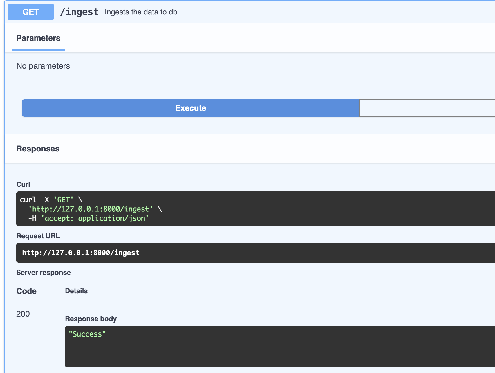
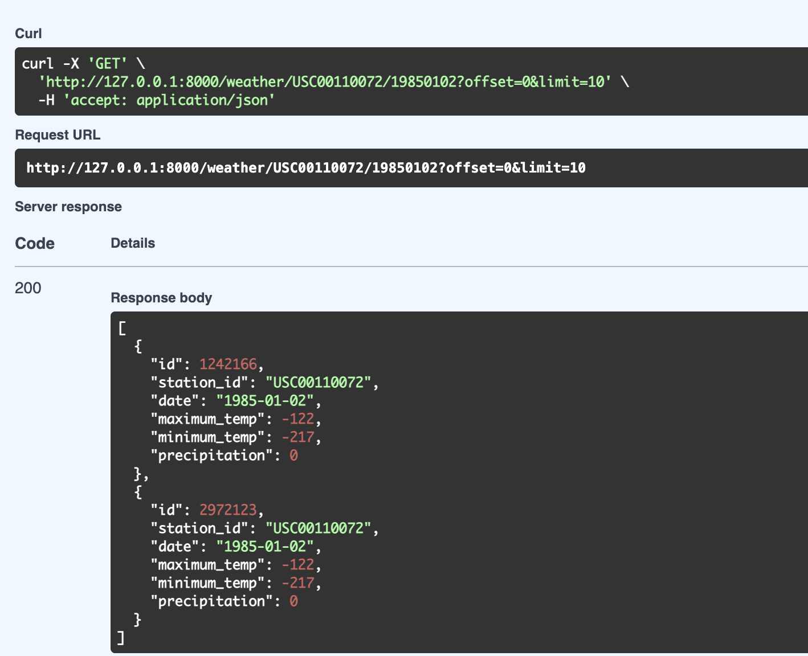
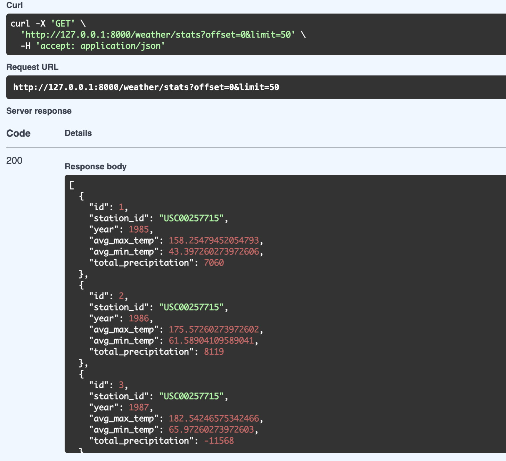

# Weather Api Challenge

## Description
This is a Weather API Application to access the weather data of different stations.


## Requirements
- Python 3.10 or higher
- FastAPI
- SQLAlchemy

## Running the project

### Creation of virtual environment
Command to create a virtual environment.
```bash
python3 -m venv venv
```
Command to activate virtual environment
```bash
source venv/bin/activate
```

### Installation of project requirements
```bash
pip install -r requirements.txt
```

### Running the api server
```bash
uvicorn src.main:app --reload
```

### Running tests
```bash
pytest --cov
```

## API Documentation
After running the project and use following URL to access the API documentation.
```
http://localhost:8000/docs
```

## API Endpoints
- GET `/ingest`
    - Starts ingestion of Weather data
    - Example: `/ingest`

### Example Response

```json
{
    "status": "Success"
}
```
- GET `/weather`
    - Returns the list of  weather
    - Query Parameters:
        - `station_id`: The station id to filter the records.
        - `date`: The date to filter the records. `(Format: YYYYMMDD)`
        - `offset`: The offset of the first record to return. Default is 0.
        - `limit`: The number of records to return. Default is 50.
    - Example: `/weather?offset=0&limit=50`
    - Example: `/weather?station_id=USC00114198&date=19850103`
    - Example: `/weather?station_id=USC00114198`

### Example Response

```json
[
  {
    "id": 1,
    "station_id": "USC00257715",
    "date": "1985-01-01",
    "maximum_temp": -83,
    "minimum_temp": -144,
    "precipitation": 0
  }
]
```
- GET `/weather/stats`
    - Returns the weather stats.
    - Query Parameters:
        - `station_id`: The station id to filter the records.
        - `year`: The year to filter the records.
        - `offset`: The offset of the first record to return. Default is 0.
        - `limit`: The number of records to return. Default is 50.
    - Example: `/weather/stats`
    - Example: `/weather/stats?offset=0&limit=50&year=1985&station_id=USC00113879`

### Example Response

```json
[
  {
    "id": 30,
    "station_id": "USC00113879",
    "year": 1985,
    "avg_max_temp": 193.6904109589041,
    "avg_min_temp": 74.82191780821918,
    "total_precipitation": 14473
  }
]
```
