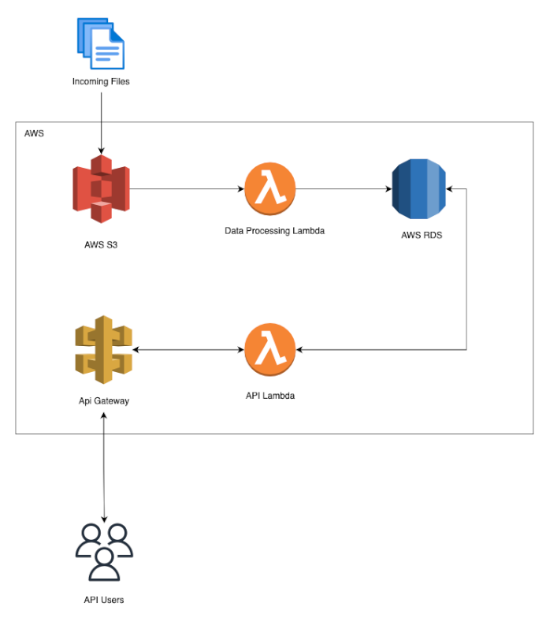

# Weather Api Challenge

## Description
This is a Weather API Application to access the weather data of different stations.


## Requirements
- Python 3.10 or higher
- FastAPI
- SQLAlchemy

## Running the project

### Creation of virtual environment
Command to create a virtual environment.
```bash
python3 -m venv venv
```
Command to activate virtual environment
```bash
source venv/bin/activate
```

### Installation of project requirements
```bash
pip install -r requirements.txt
```

### Running the api server
```bash
uvicorn src.main:app --reload
```

### Running tests
```bash
pytest --cov
```

## API Documentation
After running the project and use following URL to access the API documentation.
```
http://localhost:8000/docs
```

## API Endpoints
- GET `/ingest`
    - Starts ingestion of Weather data
    - Example: `/ingest`

### Example Response

```json
{
    "status": "Success"
}
```
- GET `/weather`
    - Returns the list of  weather
    - Query Parameters:
        - `station_id`: The station id to filter the records.
        - `date`: The date to filter the records. `(Format: YYYYMMDD)`
        - `offset`: The offset of the first record to return. Default is 0.
        - `limit`: The number of records to return. Default is 50.
    - Example: `/weather?offset=0&limit=50`
    - Example: `/weather?station_id=USC00114198&date=19850103`
    - Example: `/weather?station_id=USC00114198`

### Example Response

```json
[
  {
    "id": 1,
    "station_id": "USC00257715",
    "date": "1985-01-01",
    "maximum_temp": -83,
    "minimum_temp": -144,
    "precipitation": 0
  }
]
```
- GET `/weather/stats`
    - Returns the weather stats.
    - Query Parameters:
        - `station_id`: The station id to filter the records.
        - `year`: The year to filter the records.
        - `offset`: The offset of the first record to return. Default is 0.
        - `limit`: The number of records to return. Default is 50.
    - Example: `/weather/stats`
    - Example: `/weather/stats?offset=0&limit=50&year=1985&station_id=USC00113879`

### Example Response

```json
[
  {
    "id": 30,
    "station_id": "USC00113879",
    "year": 1985,
    "avg_max_temp": 193.6904109589041,
    "avg_min_temp": 74.82191780821918,
    "total_precipitation": 14473
  }
]
```


# AWS Deployment

Deploying the Weather API Challenge application using AWS SAM (Serverless Application Model). The application will be using AWS S3 for file storage, AWS Lambda for processing data, and AWS RDS for data storage. The application exposes API endpoints using Api Gateway and Lambda function that fetch data from the RDS and return it to the user.

## Prerequisites

- AWS CLI installed and configured with your AWS account.
- AWS SAM CLI installed.
- Python 3.10 or higher installed.


## Architecture



- The application will be using AWS S3 for file storage.

- When a file is uploaded to the S3 bucket, AWS Lambda function will be triggered to process the data and store it in an AWS RDS instance. 

- The application will expose two API endpoints via AWS API Gateway that fetch data from the RDS instance using another Lambda Function.

- AWS API Gateway can be used to document the APIs.

This is the most cost-effective and scalable solution as our application only has two API endpoints. 


## Services Used
1. AWS S3 - For file storage.
2. AWS Lambda - For processing data.
3. AWS RDS - For data storage.
4. AWS API Gateway - For exposing API endpoints.
5. AWS CloudFormation - For managing the application resources.

## Deployment Steps
Deploying is also simple using the AWS SAM CLI. The SAM CLI will build the application and deploy it to AWS using CloudFormation.

1. **Build the SAM application**

    Use the SAM CLI to build our application:

    ```bash
    sam build
    ```

2. **Deploy the SAM application**

    Deploy your application:

    ```bash
    sam deploy --stack-name weather_api
    ```

3. **Cleanup**

   To delete the application:

   ```bash
   sam delete --stack-name weather_api
   ```

## Conclusion

This Weather API Application provides an efficient and scalable solution for accessing and processing weather data of various stations. By leveraging AWS's serverless architecture, we can ensure high performance and reliability.
